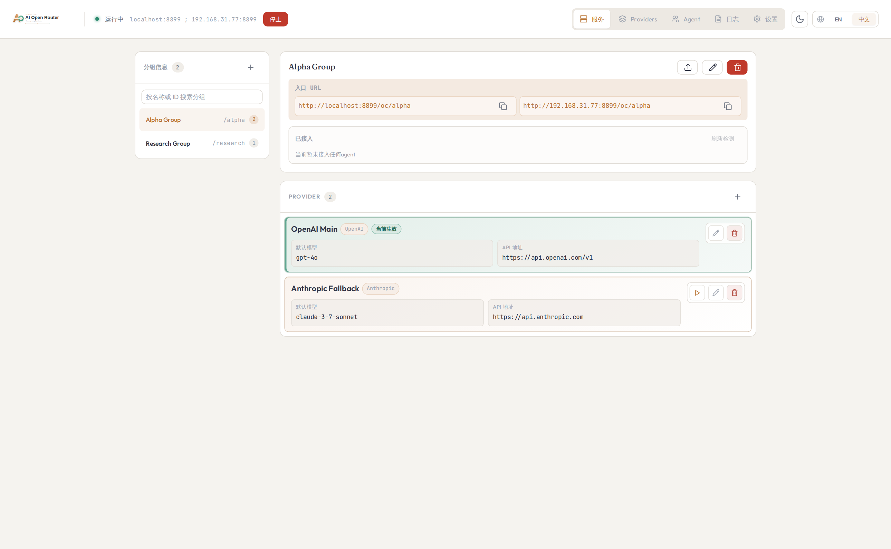
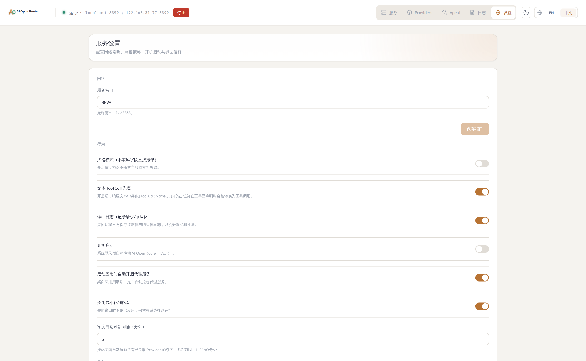
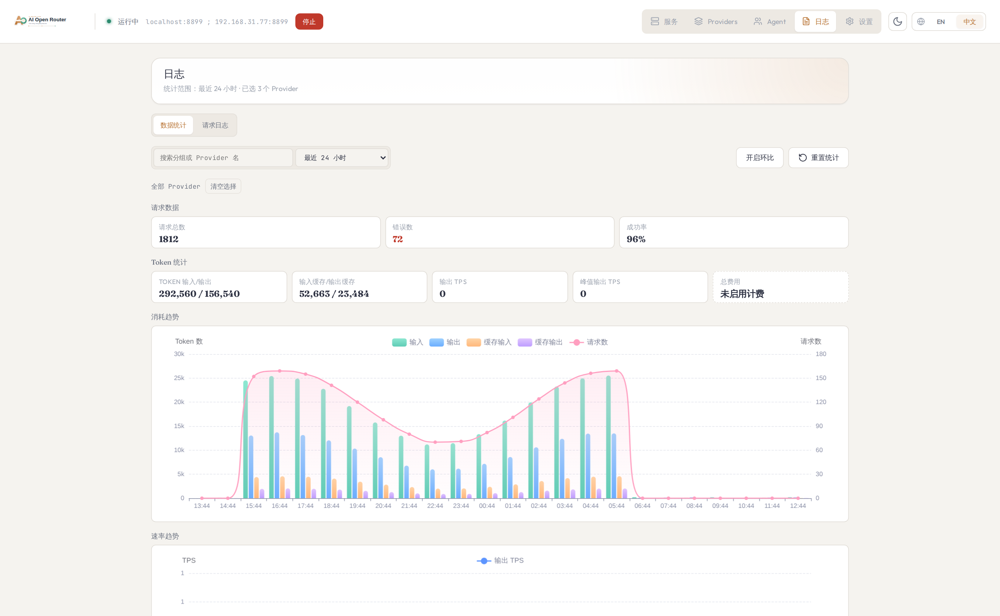

# AI Open Router

桌面代理服务，用于在 OpenAI 兼容协议与 Anthropic 协议之间做双向路由与转换。

English documentation: [../../README.md](../../README.md)

开发文档（数据流/逻辑流）：[development-flow.md](./development-flow.md)

## 概览

AI Open Router 是基于 Tauri 的桌面应用，内置本地代理运行时。
它按分组路由请求，按分组的生效规则转发，并在 OpenAI 兼容协议与 Anthropic 协议之间做请求/响应转换。

## 核心功能点（详细）

1. 分组化网关管理
   - 支持创建多个分组，每个分组都有独立路径（`/oc/:groupId`）和规则集合。
   - 可配置分组名称与模型列表。
   - 每个分组通过 `activeRuleId` 指定一条当前生效规则。
2. 规则级上游控制
   - 分组下可维护多条规则，并可随时切换生效规则。
   - 每条规则可配置：协议（`openai`/`anthropic`）、Token、上游 API 地址、默认模型、模型映射。
   - 模型映射支持精确/前缀/通配匹配（结合分组模型匹配逻辑）。
3. 统一本地入口（兼容多种客户端）
   - 一个本地服务同时接收 OpenAI 兼容与 Anthropic 风格请求。
   - 入口支持 `chat/completions`、`responses`、`messages`；`/oc/:groupId` 默认回落到 chat-completions。
   - 运行状态可同时展示 localhost 与局域网地址（满足条件时）。
4. 分组/规则备份恢复
   - 支持导出 JSON 到文件夹或剪贴板。
   - 支持从文件或剪贴板 JSON 导入。
   - 导入兼容多种 JSON 结构，执行后会覆盖当前全部分组与规则。
5. 远程 Git 同步
   - 支持将分组/规则备份 JSON 同步到远程 Git 仓库分支。
   - 上传本地数据或从远端拉取 `groups-rules-backup.json`。
   - 内置本地/远端时间冲突检测与二次确认。
6. 日志与统计
   - 实时请求日志，包含状态、分组/规则信息、协议方向、上游目标、Token 用量等。
   - 日志详情可查看请求/响应头与请求/响应体（开启记录时）。
   - 支持按时间窗口和规则筛选统计，并在本地持久化保留。
7. 规则额度可视化
   - 每条规则可单独配置额度查询接口与映射规则。
   - 规则卡片直接显示剩余额度状态（`ok`、`low`、`empty` 等）。
   - 通过 JSONPath/表达式适配不同 provider 的响应结构。
8. 桌面端运行行为
   - 支持开机启动、关闭最小化到托盘。
   - 支持主题与语言切换。
   - 支持关于面板查看应用名称和版本。

## 当前功能

### 代理与路由

- 按分组路径路由：`/oc/:groupId/...`
- 每个分组通过 `activeRuleId` 指定当前生效规则
- 支持入口端点：
  - `POST /oc/:groupId/chat/completions`
  - `POST /oc/:groupId/responses`
  - `POST /oc/:groupId/messages`
- `POST /oc/:groupId` 默认按 chat-completions 处理
- 健康与运行指标端点：
  - `GET /healthz`
  - `GET /metrics-lite`

### 协议转换

- OpenAI 兼容 -> Anthropic 的请求/响应映射
- Anthropic -> OpenAI 兼容的请求/响应映射
- 基础 tool call 字段映射
- 流式行为：
  - 同协议转发时支持 SSE 透传
  - OpenAI chat-completions -> Anthropic messages 支持 SSE 事件桥接转换
  - 其他跨协议流式场景当前仍直通上游 SSE 字节流
  - Anthropic 入口请求若未显式传 `stream`，默认按 `stream=true` 转发

### 模型路由

- 分组模型列表用于决定模型匹配与映射范围
- 支持匹配方式：
  - 精确匹配（如 `a1`）
  - 前缀匹配（如 `a1` 可匹配 `a1-mini`）
  - 通配后缀（如 `a1*`）
- 规则 `modelMappings` 会在匹配后生效
- 未命中映射时回落到规则 `defaultModel`

### 规则额度查询

- 每条规则支持配置：
  - `enabled`、`provider`、`endpoint`、`method`
  - `useRuleToken` / `customToken`
  - `authHeader`、`authScheme`、`customHeaders`
  - `response.remaining`、`response.unit`、`response.total`、`response.resetAt`
  - `lowThresholdPercent`
- 服务页可在规则卡片查看剩余额度，并支持单条刷新。

映射示例：

```json
{
  "response": {
    "remaining": "$.data.remaining_balance",
    "unit": "$.data.currency",
    "total": "$.data.total_balance",
    "resetAt": "$.data.reset_at"
  }
}
```

```json
{
  "response": {
    "remaining": "$.data.remaining_balance/$.data.remaining_total",
    "unit": "$.data.unit"
  }
}
```

表达式支持与安全约束：
- 仅支持数字字面量、`+ - * /`、括号、`path('$.x.y')`
- 支持内联写法（如 `$.a/$.b`）
- 不执行脚本，不依赖 `eval` 或外部进程

### 桌面界面

- 服务页：
  - 创建/删除分组
  - 创建/编辑/删除规则
  - 切换分组生效规则
  - 复制分组入口 URL
- 服务状态栏与分组卡片同时显示可访问地址：
  - localhost 地址
  - 局域网 IP 地址（绑定 `0.0.0.0`/`::` 时）
- 分组编辑页：
  - 编辑分组名称
  - 编辑模型列表
- 规则创建/编辑页：
  - 协议、Token、API 地址、默认模型
  - 模型映射
  - 额度查询接口与剩余额度映射配置
  - Token 明文/隐藏切换
- 日志页：
  - 请求列表、状态筛选、刷新、清空
  - 规则筛选 + 时间窗口筛选
  - 统计汇总（请求/错误/成功率 + Token）
  - 日志详情（请求头、响应头、请求体、响应体、错误、Token）

### 设置页

- 端口配置（保存端口时会将 host 固定为 `0.0.0.0`）
- 严格模式开关（`compat.strictMode`）
- 详细日志开关（`logging.captureBody`）
- 开机启动开关
- 关闭最小化到托盘开关
- 主题与语言切换
- 分组/规则备份导入导出：
  - 导出到文件夹
  - 导出到剪贴板 JSON
  - 从文件导入
  - 从剪贴板 JSON 导入
- 远程 Git 同步分组规则：
  - 配置仓库 URL / Token / 分支
  - 上传本地备份 JSON 到远端
  - 从远端拉取备份 JSON 覆盖本地配置
  - 本地与远端时间冲突时二次确认
- 关于弹窗（应用名和版本）

## 使用场景

- OpenAI 兼容客户端调用 Anthropic 模型
- Claude 风格客户端调用 OpenAI 兼容模型
- 为混合工具链提供统一本地入口
- 按分组隔离不同上游的模型与凭证

## 界面截图

### 服务页



### 设置页



### 日志页



## 快速开始

### 环境要求

- Node.js `>=20`
- npm `>=10`
- Rust 工具链（`cargo`）
- Tauri CLI（`cargo tauri`）

### 安装与启动

```bash
npm install
npm start
```

`npm start` 等价于 `cargo tauri dev`。

默认监听 `0.0.0.0:8899`，通常会同时出现：
- `http://localhost:8899`
- `http://<本机局域网IP>:8899`（例如 `http://172.25.224.1:8899`）

## 入口调用示例

- `http://localhost:8899/oc/claude/chat/completions`
- `http://localhost:8899/oc/claude/responses`
- `http://localhost:8899/oc/claude/messages`

本地鉴权为可选项。开启后需携带：

```http
Authorization: Bearer <server.localBearerToken>
```

## 运行时规则解析

每个请求按以下流程处理：
1. 从路径匹配 `:groupId`
2. 定位对应分组
3. 读取分组 `activeRuleId`
4. 仅使用这条规则转发
5. 根据入口协议与规则协议做请求/响应转换

## 开发命令

```bash
npm run check
npm run test
npm run ci
```

发布流程请参考：`docs/release-process.md`
数据库与本地持久化说明请参考：`docs/dev-database.md`

## 调试指南

```bash
# 启动桌面开发模式
npm start

# 仅启动前端
npm run dev

# 检查本地代理状态
curl http://localhost:8899/healthz
curl http://localhost:8899/metrics-lite

# 发布前校验版本一致性
npm run version:check

# 发布规划 dry-run（不改文件）
npm run release:plan
```

排查建议：
- 请求异常时先看应用内日志页，再检查 `GET /healthz` 与 `GET /metrics-lite`。
- 测试失败时执行 `npm run test:rust` 直接验证后端单测。
- 若仅发布相关 CI 失败，本地先运行 `npm run release:plan -- --from-tag <tag>` 复现。
- 若发布说明为空，确认 `CHANGELOG.md` 中存在 `## vX.Y.Z - YYYY-MM-DD` 小节。

## 发布速查

```bash
# 1) 预览版本号和 changelog（建议指定基线 tag）
npm run release:plan -- --from-tag v0.2.1

# 2) 生成版本升级与 changelog
npm run release:prepare -- --from-tag v0.2.1

# 3) 提交发布变更并发起 PR
git checkout -b release/vX.Y.Z
git add package.json package-lock.json src-tauri/Cargo.toml src-tauri/tauri.conf.json CHANGELOG.md
git commit -m "chore(release): vX.Y.Z"

# 4) 合并到 main（CI 会自动创建 vX.Y.Z tag 并触发 Release Build）
```

完整流程见：`docs/release-process.md`

## 打包命令

```bash
npm run tauri:build
npm run tauri:build:win
npm run tauri:collect
```

说明：
- `npm run tauri:build` 会设置 `CARGO_TARGET_DIR=dist/target`，执行 `cargo tauri build`，然后收集产物到 `dist/`。
- `npm run tauri:build:win` 会构建 `x86_64-pc-windows-gnu` 并收集产物。
- 如果手动执行 `cargo tauri build`，后续可执行 `npm run tauri:collect` 收集产物。

## 构建产物

- `out/renderer`：前端构建产物
- `dist/target`：npm 打包脚本使用的 Rust/Tauri target 目录
- `dist`：收集后的安装包/可执行产物（按平台可用性）

## 配置与持久化

首次启动会在应用数据目录生成以下文件：

- `config.json`：基础配置
- `providers.sqlite`：分组与 Provider（原规则）配置
- `request-stats.sqlite`：请求统计事件数据

核心配置：
- `server`：host、port、本地 Bearer 鉴权
- `compat`：严格模式
- `logging`：请求体记录与脱敏规则
- `ui`：主题、语言、启动与托盘行为
- `remoteGit`：远程同步配置
- `groups[]`：运行态存在；持久化以 `providers.sqlite` 为准

数据行为：
- 请求日志列表在内存中保存（默认最多 100 条）
- 聚合统计基于 `request-stats.sqlite` 事件数据实时汇总
- 统计数据当前默认持续保留（无自动过期清理）
- 导入备份会覆盖当前全部分组与规则

## 安全说明

- 规则 Token 与远程 Git Token 会以明文保存在本地配置中。
- 生产或准生产环境请使用最小权限凭证。
- 如需通过局域网地址访问，请仅在可信网络中使用。
