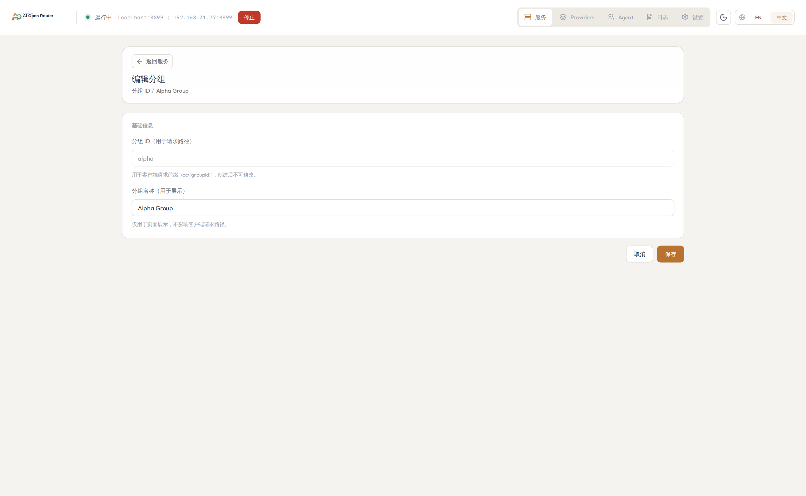
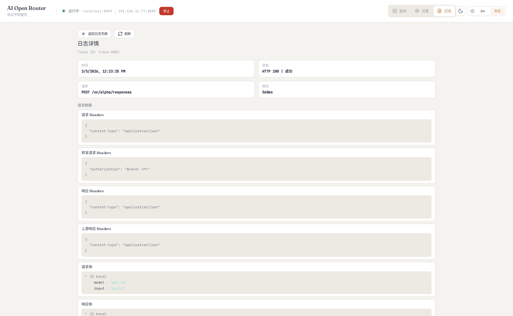

# AI Open Router

一个桌面端本地 AI 网关：**统一入口、协议切换、Token/费率统计、云备份、自动更新**。

English documentation: [../../README.md](../../README.md)

开发文档（数据流/逻辑流）：[development-flow.md](./development-flow.md)

## 为什么用它

- 多个 AI 提供商协议不一致，客户端接入成本高。
- 团队常常需要“同一个入口”切换不同上游 Provider。
- 需要把 Token 消耗、请求成功率、费率剩余看清楚。
- 配置容易丢失，需要可回滚、可同步的云备份能力。
- 需要应用自动更新，减少手动下载升级成本。

## 核心功能（你关心的 5 点）

| 功能 | 解决什么问题 | 在哪里使用 |
| --- | --- | --- |
| 协议切换 | OpenAI 兼容客户端与 Anthropic 客户端可共用一个本地网关 | 服务页（分组 + Provider） |
| 费率统计 | 每个 Provider 展示剩余额度与状态（`ok`/`low`/`empty`） | 服务页 Provider 卡片 |
| Token 统计 | 按时间窗口/Provider 查看请求量、成功率、Token 用量 | 日志页（统计区） |
| 云备份（Git） | 分组与 Provider 可上传/拉取，支持冲突检测 | 设置页（Remote Git） |
| 自动更新 | 从 GitHub Releases 检测并安装更新 | 设置页（更新） |

## 3 分钟上手（新用户必看）

### 1）启动应用

从系统启动器打开桌面应用。

### 2）创建第一个路由分组

1. 进入“服务页”创建分组（例如 `claude`）。
2. 在分组中设置模型列表（可先填 `claude-3-5-sonnet`）。
3. 记住入口前缀：`/oc/<groupId>`。

### 3）添加 Provider

1. 新增一个或多个 Provider。
2. 填写协议（`openai` 或 `anthropic`）、上游 API 地址、Token、默认模型。

### 4）在分组中关联 Provider

1. 在分组内关联你要使用的 Provider。
2. 启用其中一个为当前生效 Provider。

### 5）写入到 Agent

通过集成面板把分组配置写入你正在使用的 Agent（Claude / Codex / OpenCode）。

### 6）切换 Provider

新增 Provider 后关联到分组，并在分组内切换为生效 Provider。

## 功能详解

### 1）协议切换（OpenAI 兼容 ↔ Anthropic）

你可以让不同协议客户端都走同一本地入口，减少客户端改造成本。

- 分组路径：`/oc/:groupId/...`
- 支持入口：
  - `POST /oc/:groupId/chat/completions`
  - `POST /oc/:groupId/responses`
  - `POST /oc/:groupId/messages`
- `POST /oc/:groupId` 默认按 `chat/completions` 处理
- 每次请求只使用分组的 `activeProviderId` 对应 Provider 转发

处理流程：
1. 从路径解析 `groupId`
2. 找到分组和 `activeProviderId`
3. 按 Provider 转发到上游
4. 按入口协议与 Provider 协议进行请求/响应转换

### 2）费率统计（Provider 额度可视化）

每个 Provider 可以配置独立额度查询接口，并在 Provider 卡片直接展示剩余状态。

可配置字段：
- `endpoint`、`method`、`authHeader`、`authScheme`
- `useRuleToken` / `customToken`
- `response.remaining`、`response.total`、`response.unit`、`response.resetAt`
- `lowThresholdPercent`

示例映射：

```json
{
  "response": {
    "remaining": "$.data.remaining_balance",
    "unit": "$.data.currency",
    "total": "$.data.total_balance",
    "resetAt": "$.data.reset_at"
  }
}
```

```json
{
  "response": {
    "remaining": "$.data.remaining_balance/$.data.remaining_total",
    "unit": "$.data.unit"
  }
}
```

表达式仅支持数字、`+ - * /`、括号和 JSONPath，不执行脚本。

### 3）Token 统计（请求视角 + 聚合视角）

- 实时日志：查看单次请求的状态、协议方向、上游目标、Token 用量。
- 聚合统计：按时间窗口 + Provider 筛选查看请求数、错误数、成功率与 Token。
- 明细排查：在日志详情查看请求头/响应头/请求体/响应体（开启 `logging.captureBody` 时）。

### 4）云备份（Remote Git）

在设置页配置 `repo URL + token + branch` 后可执行：
- 上传本地分组/Provider 备份到远端 `groups-rules-backup.json`
- 从远端拉取备份覆盖本地
- 本地和远端时间冲突时二次确认

适用场景：
- 换机器快速恢复配置
- 团队共享同一套路由 Provider 模板
- 回滚错误配置

### 5）自动更新

在设置页开启自动更新后可：
- 检测 GitHub Releases 是否有新版本
- 下载并安装更新（支持查看更新说明）

## 界面预览

### 协议切换与 Provider 管理（服务页）


### 分组模型配置



### 费率统计配置（Provider 编辑）


### 云备份与更新设置


### Token 统计与日志排查


### 请求明细排查



## 常见问题（FAQ）

### 需要改造现有客户端吗？

通常不需要。大多数情况下只需把请求地址改为本地入口 `http://localhost:8899/oc/:groupId/...`。

### 一个分组能挂多个 Provider 吗？

可以。一个分组下可维护多个 Provider，但同一时间只会有一个生效（`activeProviderId`）。

### 云备份拉取会覆盖本地吗？

会。导入或远端拉取都会覆盖当前分组与 Provider，建议先导出本地备份。

### Token 和 Git Token 安全性如何？

当前会保存在本地配置中（明文），请使用最小权限凭证，并仅在可信环境使用。

### macOS 提示“应用已损坏”，如何处理？

这通常是因为未完成公证或未使用 Apple Developer ID 签名。若你信任来源，可以按下面方式放行：

1. 将应用移动到 `~/Applications` 或 `/Applications`。
2. 打开 macOS 的 `系统设置` -> `隐私与安全性`，在提示处点击“仍要打开”。
3. 若仍被拦截，可移除隔离标记后再试：

```bash
xattr -dr com.apple.quarantine "/Applications/AI Open Router.app"
```

## 用户文档与开发文档分层

面向使用者：
- 本文档（上手与功能说明）

面向开发者：
- `docs/dev-database.md`（数据与持久化）
- `docs/release-process.md`（发布流程）
- `docs/tauri-architecture.md`（架构说明）

## 开发命令（开发者）

```bash
npm run check
npm run test
npm run ci
```

## 使用 Playwright 重新生成截图

```bash
npm run screenshots:mock
```

默认会生成：
- `docs/assets/screenshots/service-page.png`
- `docs/assets/screenshots/group-edit-page.png`
- `docs/assets/screenshots/rule-edit-page.png`
- `docs/assets/screenshots/settings-page.png`
- `docs/assets/screenshots/logs-page.png`
- `docs/assets/screenshots/log-detail-page.png`
